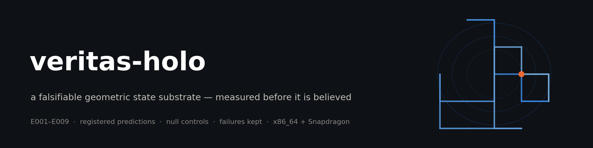
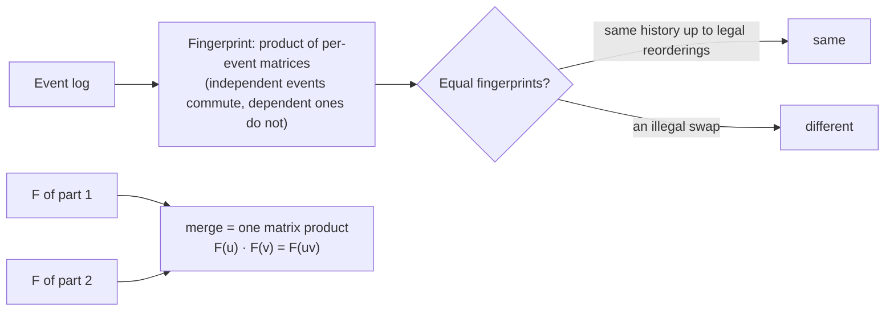
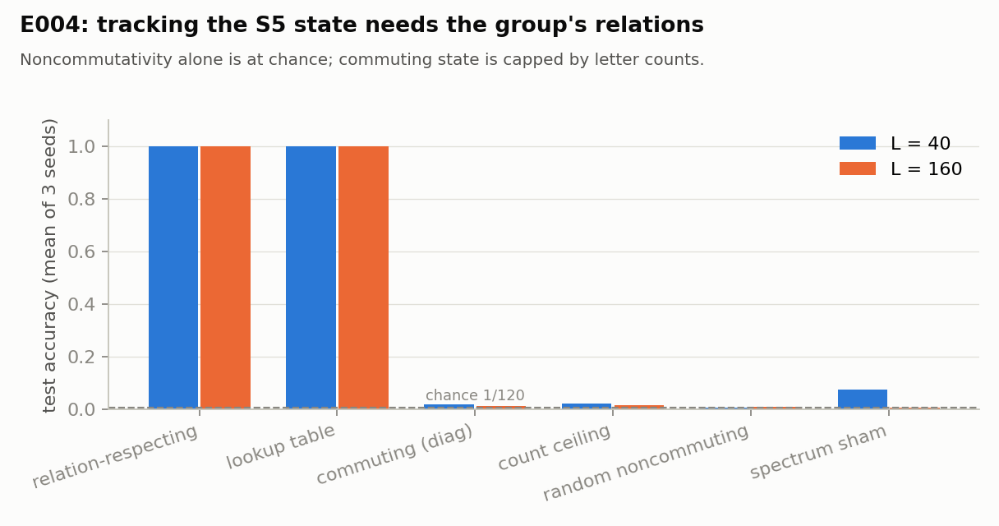
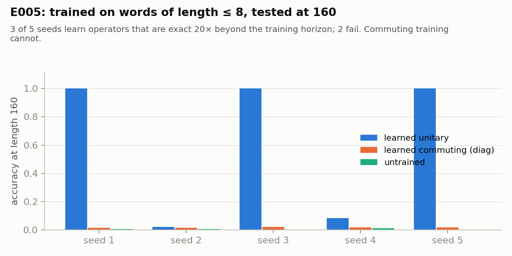
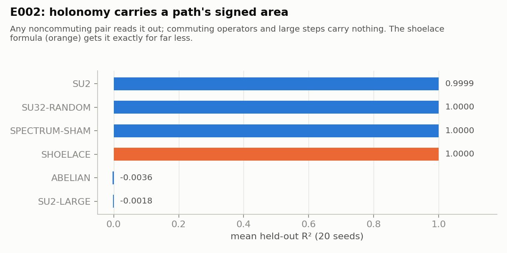
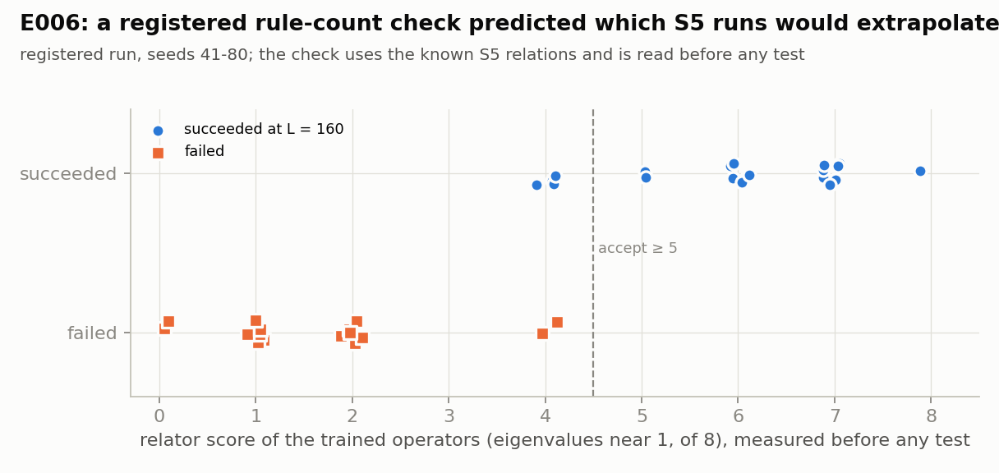
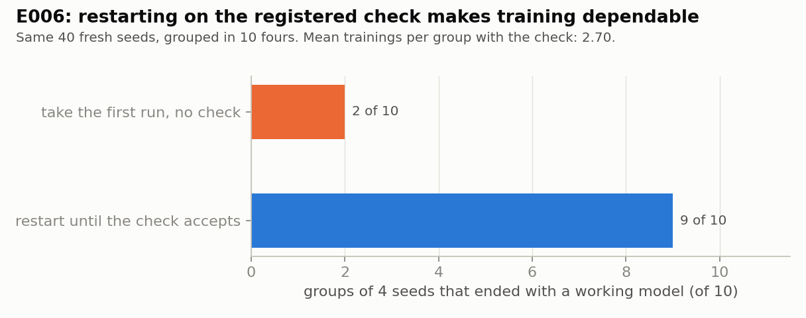
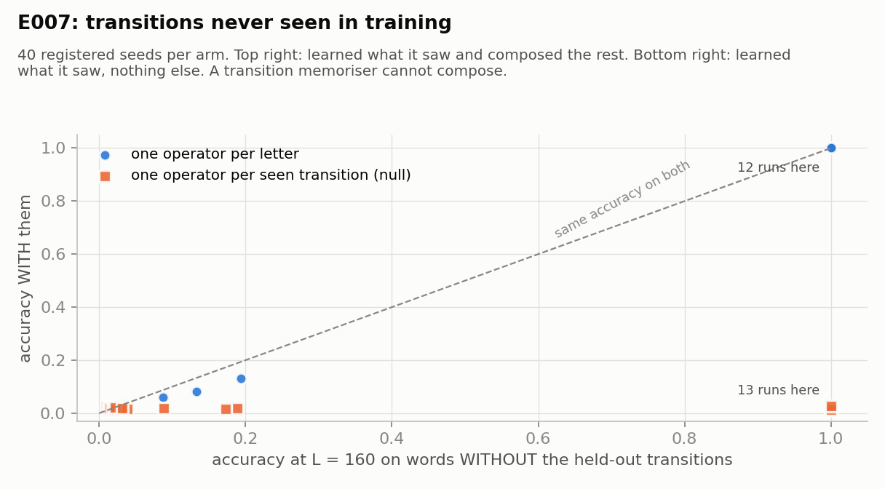

# veritas-holo

<!-- 30s-demo -->
> **Status labels.** **RESEARCH HYPOTHESIS:** that geometric state gives a reasoning advantage at equal
> compute. This is not shown; no such task has been found (E7). **PROTOTYPE:** the reference implementation
> and the experiments below. **NOT PRODUCTION-READY:** all of it. No language model is involved anywhere.

**Headline (measured, [E003](experiments/E003_trace_fingerprint/)):** a fingerprint of concurrent event
logs that ignores harmless reorderings merges in 4.0 µs at 100 events and 4.4 µs at 100,000. The
per-resource SHA-256 baseline takes 17,239 µs to extend at 100,000. Its equality matched ground truth on
3000 of 3000 pairs.

### 30-second demo: PROTOTYPE

```bash
git clone https://github.com/holland202/veritas-holo && cd veritas-holo
pip install numpy && python experiments/E003_trace_fingerprint/run.py      # about 7 s
```

Output (x86_64, Python 3.11, NumPy 2.4.4, 2026-09-30), pasted as printed:

```
VERITAS-HOLO E003 | seeds 1-5 | x86_64 | Python 3.11.15 | NumPy 2.4.4
alphabet: 12 actions over 5 resources: 0:24 1:0 2:0 3:4 4:23 5:23 6:13 7:01 8:03 9:04 10:2 11:1
logs: 1000 of length 200; legal shuffle = 50 independent swaps; SL(2, F_p) check 5 of 5 seeds
BASE (per-resource SHA-256) equality agrees with ground truth on 3000 of 3000 pairs
merge time HF: 4.0 us (|v|=100), 4.4 us (|v|=100000)
extend time BASE: 19.3 us (|v|=100), 17239.3 us (|v|=100000)
build time per event: HF 1.78 us, BASE 0.34 us
HELD   T1  legal shuffles same history 1000/1000, HF unchanged 1000/1000
HELD   T2  illegal swaps different history 1000/1000, HF changed 1000/1000
HELD   T3  HF equality = ground truth on 3000/3000 pairs
HELD   T4  merge(F(u),F(v)) = F(uv) 1000/1000; 16-segment tree 1000/1000
HELD   T5  N1 commuting accepts illegal swaps 1000/1000 = 1.0000 >= 0.99
HELD   T6  N2 one-block rejects legal shuffles 1000/1000 = 1.0000 >= 0.99
HELD   T7  merge-time ratio 100000/100: HF 1.09 < 3, BASE 894.6 > 100
HELD   T8  per-event build: HF 5.3x BASE (HF slower, as registered)
VERDICT  8 of 8 registered predictions held
```

### Negative results, up front

- **Accuracy is not the advantage.** The plain per-resource SHA-256 baseline is also right on 3000 of
  3000 pairs (line 4 above), and it builds 5.3× faster per event (T8). What the fingerprint adds is
  merging from fingerprints alone.
- **Holonomy carries signed area, and the shoelace formula computes it exactly for far less.** There is
  no advantage there ([E002](experiments/E002_holonomy_area/)).
- **Kept failures:** 2 of 6 predictions failed in [E004](experiments/E004_group_state/), and 2 of 4 in
  [E009](experiments/E009_blind_check_lowprecision/). Byte-exact replay across platforms was refuted
  (E001 P9).
- **A label-free certificate proves self-consistency, not correctness.** In exploratory label-free group
  discovery, 8 of 40 runs were certified and wrong.
- **No equal-compute reasoning advantage exists yet (E7).** Until one does, no language model gets wired in.



### Why this is not just hashing, a CRDT, or local inference

- **Not just a hash.** A hash of the byte stream changes on every harmless reordering. A sorted multiset
  hash ignores harmful ones too; that is control N1 above, which accepts 1000 of 1000 illegal swaps.
  This fingerprint separates the two: T1 and T2 above.
- **Not a CRDT.** CRDTs merge replicated *state*. This merges *fingerprints of histories* without the
  events. The math underneath (trace monoids, matrix representations) is textbook; the contribution here
  is the measured instrument, not new theory.
- **Not inference.** Nothing is learned in E003. The learned experiments (E005–E012) train tiny operators
  on group words, not language.
<!-- /30s-demo -->


**A falsifiable geometric reasoning substrate: finite-state manifolds, operator dynamics and
invariant constraints, built to be measured before it is believed.**

> Research question: can a compact, explicitly structured geometric state-transition system give
> measurable reasoning advantages over an equivalent unconstrained computation, at the same compute
> budget, against a sham with the structure destroyed?

Nothing in this repository answers that yet. What exists is the first instrument.

## Status

| experiment | what it asks | status |
|---|---|---|
| [E001](experiments/E001_operator_algebra/) | does the reference implementation obey the algebra (closure, inverse, commutators, holonomy, invariants, replay)? | **10 of 10 held** on x86_64 and on the S25; byte replay across platforms refuted (P9), replay to 10 decimals replicated (P10) |
| [E002](experiments/E002_holonomy_area/) | what does holonomy carry, and does it beat a cheap exact computation? | **6 of 6 held** on x86_64 and on the S25: it carries signed area for any noncommuting operators (P8's sham included); the shoelace formula gets it exactly for far less. **No advantage.** |
| [E003](experiments/E003_trace_fingerprint/) | can a holonomy fingerprint concurrent histories, forgiving legal reorderings and merging from fingerprints alone? | **8 of 8 held** on x86_64 and on the S25: exact on 3000 of 3000 pairs; merge time flat from 100 to 100,000 events. The advantage is composition, not information or speed. |
| [E004](experiments/E004_group_state/) | which kinds of recurrent state can track S5, the group behind the state-space-model limits? | **4 of 6 held, 2 FAILED (kept)**: relation-respecting operators exact at L=40, 160; commuting ones capped by letter counts; relation-free ones at chance. G1 failed on a readout flaw; G5's sham kept a fading signal. |
| [E005](experiments/E005_learned_state/) | can training discover a group's state from short examples, with no relations given? | **6 of 6 held**: learned from words of length ≤ 8, exact at length 160 (20× the training horizon) on 3 of 5 seeds; 2 failed; the relations appear in the learned operators; commuting training stays at the count ceiling. |
| [E006](experiments/E006_restart_diagnostic/) | can the trained operators show, before any test, whether training worked? | **4 of 4 held**: all 17 accepted runs worked and all 17 low-score runs failed; picking by the score gave a working model in 9 of 10 groups against 2 of 10 blind. The score knows S5's relations. |
| [E007](experiments/E007_heldout_composition/) | do learned operators handle transitions never seen in training, where a transition memoriser cannot? | **3 of 3 held**: all 12 runs that learned the seen words scored 1.0 on words full of unseen transitions; the memorising null (13 runs that learned the seen words) stayed at chance on them |
| [E008](experiments/E008_drift_and_snapping/) | is drift unavoidable in a continuum representation, and does snapping to a finite codebook stop it? | **4 of 4 held**: rounding drift 6.5e-10 after 1e6 steps (negligible); operator error kills decoding by 1e4 steps; snapping every step restores it to 1e5 |
| [E009](experiments/E009_blind_check_lowprecision/) | can a check that does not know the group's relations predict training success; do learned operators survive half precision? | **2 of 4 held, 2 FAILED (kept)**: the blind residual is informative (AUC 0.904) but not a gate; all 22 successful runs stayed exact at L=10000 in float16 |
| [E010](experiments/E010_a5_composition/) | does E007's held-out composition hold on a different group (A5, 3-cycle generators)? | **3 of 3 held**: 40 of 40 runs learned the seen words and scored 1.0 on unseen transitions; the memorising null stayed at chance (max 0.0240) |
| [E011](experiments/E011_snap_certificate/) | can a finite check decide, for every length, whether snapping to a codebook decodes exactly; can the codebook come from data? | **5 of 5 held**: in 300 of 300 runs a 242-product margin agreed with a 10⁴-step run (210 certified, all exact; 90 not, all wrong); a data-built codebook is certified to about δ = 0.1 |
| [E012](experiments/E012_relator_projection/) | can the codebook be recovered from noisy operators using only the orders of three relators? | **6 of 6 held**: certified 30/30 at δ ≤ 0.2 and 23/30 at 0.3, against 0/30 for E011's data codebook at 0.2; a wrong relator order: 0/120 |
| E7 | a task whose holonomy information no equal-cost classical recurrence computes | not found yet |
| language models | only after a task with an advantage exists | not started |

**v0.1 is a pure mathematical reference implementation.** No language model, no GPU, no NPU. Every
property E001 checks is a known property of unitary matrices; passing it shows the instrument
works, not that geometry helps reasoning.

## The architectural law

No semantic assertion becomes a fact directly:

    observation → proposal → formalisation → execution → invariant test → evidence

A language model, when one is added, may only *propose* transitions. The engine applies them, the
invariants check them, and the result is recorded. The model proposes; the mathematics disposes.

## What works so far

<p>


</p>
<p>


</p>
<p>
</p>

Every figure is drawn by `scripts/make_figures.py` from the committed result files, not from typed
numbers. 

- A fingerprint for concurrent logs that ignores harmless reordering and merges from fingerprints
  alone (E003).
- Relation-respecting operators track the S5 state exactly at every tested length (up to 160), while
  a commuting diagonal recurrence is limited to letter-count information (E004). The diagonal arm is
  a mathematical control, not an implementation of any particular state-space model.
- A registered rule-count check, read from the trained operators before any test, predicted which S5
  training runs would extrapolate to length 160 (17 of 17 each way; score 4 ambiguous). The check
  uses the known S5 relations. Restarting on it gave a working model in 9 of 10 groups (E006).
- Operators trained without two transitions handle them exactly once training succeeds (12 of 12),
  while a model that memorises transitions stays at chance on them (E007).
- The same held-out composition holds on a second group, A5, in 40 of 40 runs (E010).
- A finite certificate for snapping: if 242 checks on the codebook pass, snapped decoding is exact at
  every length; in 300 of 300 runs it matched a 10⁴-step run, including 90 where it said no (E011).
- Projecting noisy operators onto three relator orders (t², c⁵, (tc)⁴) recovers a codebook the
  certificate accepts up to where the true representation's does; a wrong order gives 0 of 120 (E012).
- Training on labelled words of length ≤ 8 can find S5-tracking operators: on 3 of 5 registered seeds
  they were exact at length 160, 20× the longest training word. The readout was fitted on labelled
  long words; the operators never saw one. On 2 of 5 seeds training failed (E005).

Each line links to registered predictions, controls and a replayable run. What did not work is
kept too, in [`claims/`](claims/).

## Method

New and conceptual ideas are welcome here, including ones outside the usual toolkit. An idea stays
only if it is registered, run, and verified; otherwise it is recorded as refuted.


Every claim has a registered prediction written before the code that tests it, a null control that
must come out the other way (so a checker that always passes is caught), and a status:

`PROPOSED → IMPLEMENTED → TESTED → REPLICATED`, or `REFUTED` (kept, never deleted), or `UNKNOWN`.

Claims live in [`claims/`](claims/). Results are sorted into `results/exploratory`, `registered`,
`verified` and `refuted`. Numbers in prose are pasted from program output.

## What this is not

- Not a reproduction or a clone of any other system, and not compatible with anything it has not
  been tested against.
- Not "physics-based AI". Group names such as SU(n) describe the matrices used, nothing more. Any
  physics correspondence would need its own registered claims, and none exist.
- Not a smooth manifold where the states are discrete. When a discrete analogue is used, the code
  says so.

## Run it

    pip install numpy pytest
    python experiments/E001_operator_algebra/run.py
    python -m pytest -q

Pure Python and NumPy; runs on a phone in Termux.

## Related

The evidence and gating ideas come from
[sovereign-veritas](https://github.com/holland202/sovereign-veritas), a fail-closed permission gate
whose packages anyone can re-check. Coupling the two is a later step, not a present feature.

*Vincit Omnia Veritas.*
